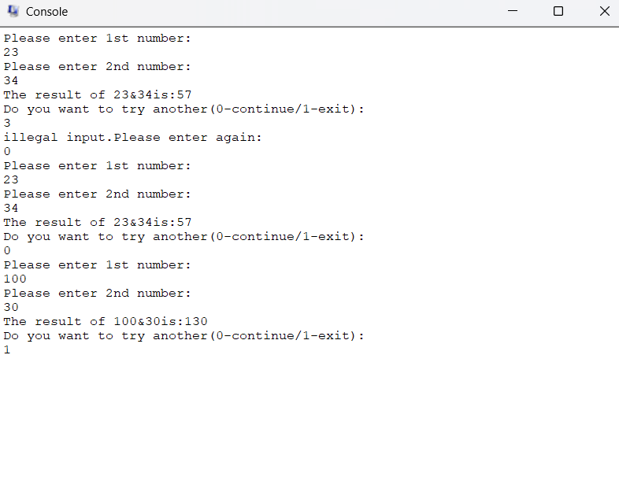
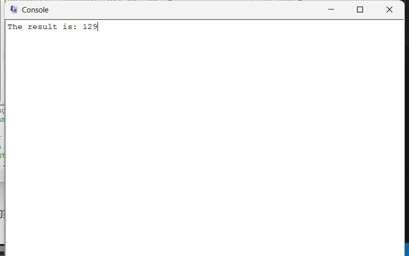
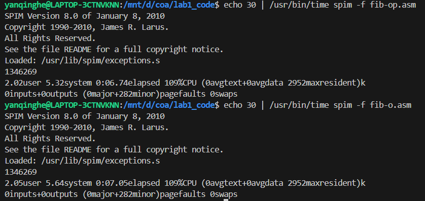
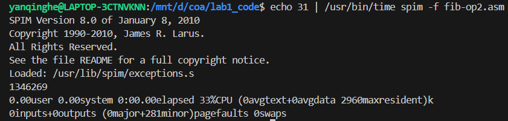

## 实验1：MIPS程序设计
实验时间：2.19-3.16

### 1.实验目的
* 熟悉QtSPIM模拟器
* 熟悉MIPS体系结构的计算，包括：
    1. MIPS数据表示
    2. 熟悉MIPS指令格式和寻址地址
    3. 熟悉MIPS汇编语言
    4. 熟悉MIPS的各种机器代码表示

### 2.实验过程
#### 2.1 调试
##### 2.1.1 p1.asm
该程序的功能是将给定的两个整数相加得到计算结果。程序运行的过程为：
1. 将需要参与计算的数值40存放在`$t2`寄存器中，17存放在`$t3`
2. 将`$t2`和`$t3`内存放的数值相加，将`$t3`更新为计算结果57

其中，以下代码希望将`$0`寄存器的值更新为40，但并没有成功。原因是在MIPS中，`$0`是一个硬编码为0的常量寄存器，其值总是为0
```rust
[00400030] 34000028  ori $0, $0, 40           ; ori $0, $0, 40
```

##### 2.1.2 p2.asm
该程序运行的过程为：
1. 将`$t2`设置为40
2. 对`$t2`中的值进行操作：将`0x1234`加载至高位，同时将地位清零，此时寄存器中的值为`0x12340000`
3. 对`$t2`中的值进行操作：将`0x12340000`和40按位取或，最终将寄存器中的值更新为`0x12340028`
4. 将`$t2`中的值更新为得到的三十二位常数：`0x12340028`
可见该程序的功能是构建32位的常数。因为MIPS中每条指令只能操作16位的立即数，所以可以通过`lui`先将高16位加载到寄存器中，再用`ori`加载低十六位，最终得到32位的常数。

##### 2.1.3 p3.asm
该程序运行的过程为：
1. 将`$t0`中的值更新为h的地址，将`$t1`中的值更新为数组A的首地址
2. 将h和A[8]的值分别加载到`$t2`和`$t3`中 
3. 将两者相加并最终将计算结果存储在A[12]中

#### 2.2 改写程序
新程序在`p1.asm`基础上需要加入
1. 输出提示语，接收两个输入的整数（分别存放在
2. 输出计算结果
3. 输出是否需要继续进行计算的提示语以及相应的分支
接下来依次进行实现
- 1. 以接受第一个整数为例，首先需要调用`print_str`的函数输出提示语，然后调用`read_int`接收输入的整数。
其中字符串地址应放入`$a0`中作为第一个参数，接收到的整数值作为返回值存放在`$v0`中

``` rust
la  $a0, enter_1_msg
li  $v0,4
syscall
li  $v0,5
syscall
move $t0,$v0
```
- 2. 输出计算结果,仅需要反复调用`print_str`和`print_int`函数
- 3. 共涉及三个分支:
    1. 若接收到输入为0,则代表继续执行:跳转到主程序开始出
    2. 若接收到输入为1,则代表停止:跳转到`end_loop`处,执行退出程序
    3. 若接受到输入为其他,则为非法输入:跳转到`re_enter`处,提示非法输入并重新进行判断(跳转到负责判断的`judge`处)

最后效果为:


#### 2.3 翻译程序
原程序由两部分组成
1. 主函数:定义数组`arr`与N,调用`sum`函数,输出结果
2. `sum`函数:遍历数组,返回数组中所有元素中的和
具体实现如下:
1. 数据部分:
```rust
    .data
arrs:  .word 9, 7, 15, 19, 20, 30, 11, 18
N:  .word 8
print_result: .asciiz "The result is: "
```
2. 主函数: 将`arrs`的首地址和N的值加载到`$a0`和`$a1`中,分别作为第一和第二个参数传递给`sumn`.函数返回后调用`print_str`和`print_int`函数输出结构
```rust
la $a0,arrs
    lw $a1,N
    jal sumn
    move $t0,$v0
    //print the result//
```
3. sumn:
- 首先将参数分别加载到saved registers:`$s0`和`$s1`中,创建一个32字节的栈帧,除了`$ra`和`$fp`,还存放两个参数以及局部变量:idx和sum
- 循环语句的实现:
    每次循环从栈帧中加载idx的值和arr数组的首地址,通过左移两位实现将idx的值乘四,以获得当前数组元素的地址,最后执行加法操作.
    每一次循环结束后,将自增后的idx值重新存放到栈帧中,并且通过`bge`语句,若超出n值,则跳转到`endloop`分支
- endloop: 将函数返回地址和栈指针加载到`$ra`和`$fp`中,将sum作为返回值通过`$v0`传递

最终在QtSpim中测试的结果如下:


#### 2.4 优化程序
首先考虑缩小每次调用函数所分配的栈空间：原先分配了32字节，事实上需要存放在栈中的变量为：`$ra`,`$fp`,`n`,`fib(n-1)`。因此分配16字节就已经足够。
然后删去了原程序中所有的`move`指令。
综上，缩减了栈空间和指令数，在n较大时性能有明显提升，下图中是n=30的测试结果


另：在`fib-o.asm`中，每一次计算`fib(n)`都需要调用两次fib函数，因此当`n>1`时，均需要进行两次栈相关的操作。
在查阅资料后，由于斐波那契数列的递归调用是函数中的最后一步，并不需要保存当前函数的状态，所以可以利用尾递归优化，将递归优化为循环。
递归表示：
```cpp
int fib(int n,int first,int second)
{
    if(n<2) return first;
    else return fib(n-1,second,first+second);
}
```
循环表示
```cpp
int fib(int n)
{
    while(n!=0)
    {
        int temp=first+second;
        first=second;
        second=temp;
        n--;
    }
    return first;
}
```
利用该方法优化的程序命名为`fib-op2.asm`，结果如下：

程序性能得到了非常显著的提升
注：此处输入为31的原因是，原数组从n=1开始
### 3.实验感想
对MIPS指令以及如何进行程序优化有了更深入的认识。最主要是认识到了算法的优化能够对程序的性能产生什么样的影响，非常有益。