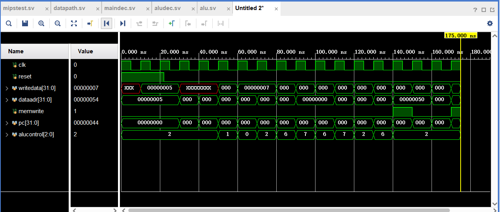
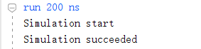
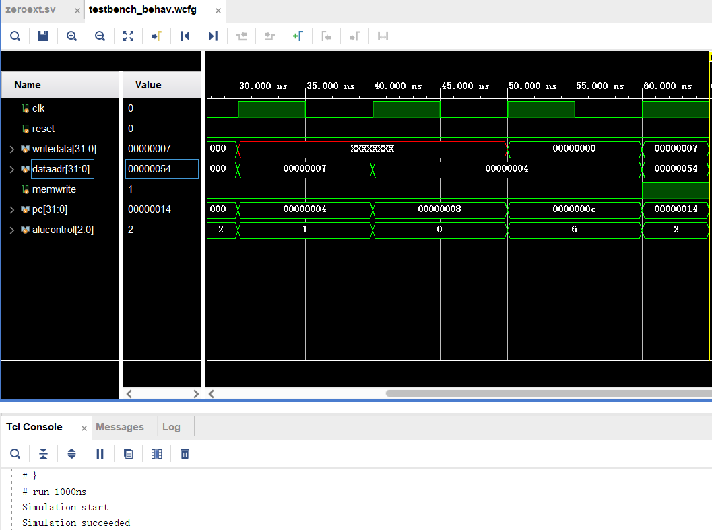

## 实验2：单周期MIPS处理器
实验时间：3.18-4.20

### 1. 设计思路
共需实现的MIPS指令可以分为以下几类：
1. R型指令：add,sub,and,or,slt,sw,lw
2. I型指令：addi,andi,ori,slti,beg,bne
3. J型指令：j
除此以外的指令均处理为nop，即当前周期什么都不做。

单周期MIPS处理器可以大致分为几个部分：
1. 指令存储器：用于存储当前程序需要执行的所有指令。
由于按字节寻址，因此使用`pc[7:2]`寻址。共六位，可以覆盖大小为`2^6`的RAM。
```systemverilog
module imem(input logic [5:0] a,
output logic[31:0] rd
    );
    logic [31:0] RAM[63:0]; //MIPS每条指令为32字节
    initial
        begin
            $readmemh("memfile.dat",RAM); //从文件中读取指令到RAM
        end
    assign rd=RAM[a];                   
endmodule
```
2. 数据存储器：用于读取/写入数据
```systemverilog
module dmem(input logic clk,we,
input logic [31:0] a,wd,
output logic [31:0] rd
    );
logic [31:0] RAM [63:0];
assign rd=RAM[a[7:2]]; //读取目标存储器中的内容
always @(posedge clk) //当写使能为1时，在下一个时钟沿到达时将数据写入存储器中
    if(we)
        RAM[a[7:2]]<=wd;                      
endmodule
```
3. 控制器：分为主译码器和ALU译码器，用于从指令中提取如：是否需要写入内存、是否是分支指令等控制信号
主译码器：解析指令的op部分
```systemverilog
module maindec( input logic [5:0] op,
output logic memtoreg,memwrite,
output logic branch,alusrc,
output logic regdst,regwrite,
output logic jump,
output logic [2:0] aluop,
output logic immext,branchbne
    );
    logic[11:0] controls;
    assign{regwrite,regdst,alusrc,branch,memwrite,memtoreg,jump,aluop,immext,branchbne}=controls;
    always_comb
        case(op)
            6'b000000: controls<=12'b110000010100; //rtype
            6'b100011: controls<=12'b101001000000; //lw
            6'b101011: controls<=12'b001010000000; //sw
            6'b000100: controls<=12'b000100000100; //beq
            6'b000101: controls<=12'b000100000101; //bne
            6'b001000: controls<=12'b101000000000; //addi
            6'b001100: controls<=12'b101000001010; //andi
            6'b001101: controls<=12'b101000001110; //ori
            6'b001010: controls<=12'b101000010000; //slti
            6'b000010: controls<=12'b000000100000; //j
            default: controls<=12'b0; //nop
        endcase
endmodule

```
ALU译码器：解析指令的func部分
```systemverilog
module aludec(input logic [5:0]func,
input logic [2:0]aluop,
output logic [2:0] alucontrol
);
always_comb
    case(aluop)
        3'b000:alucontrol<=3'b010; //add for lw/sw/addi
        3'b001:alucontrol<=3'b110; //sub for beq
        3'b010:alucontrol<=3'b000; //and for andi
        3'b011:alucontrol<=3'b001; //or for ori
        3'b100:alucontrol<=3'b111; //slt for slti
        default: case(func) //当aluop为010，表示alucontrol信号依赖于func
            6'b100000:alucontrol<=3'b010; //add
            6'b100001:alucontrol<=3'b110; //sub
            6'b100010:alucontrol<=3'b000; //and
            6'b100101:alucontrol<=3'b001; //or
            6'b101010:alucontrol<=3'b111;//slt
            default: alucontrol<=3'bxxx;
            endcase
        endcase         
endmodule
```
4. 数据路径：完成指令的执行流程。其中的主要组件有：
- 可复位触发器：在每一个时钟沿到来时更新指令。其中若reset信号为1，则将指令复位为0.
- 寄存器文件；模拟32个32位寄存器，完成寄存器中数据的读写。具体实现如下：
```systemverilog
module regfile(input logic clk,
input logic we3,
input logic [4:0] A1,A2,A3,
input logic [31:0] WD3,
output logic [31:0] RD1,RD2 );

logic [31:0] rf[31:0];
always_ff @(posedge clk) //当写使能为1时，将数据写入目标寄存器
    if(we3) rf[A3]<=WD3;

assign RD1=(A1!=0)? rf[A1]:0; //从目标寄存器中读取数据
assign RD2=(A2!=0)? rf[A2]:0;
endmodule
```
- ALU元件：根据alucontrol信号执行相应的运算
```systemverilog
module alu(input logic [31:0] a,b,
input logic [2:0] alucont,
output logic  [31:0] result,
output logic zero);
    always_comb
        case(alucont)
            3'b010: result<=a+b; //add
            3'b110: result<=a-b; //sub
            3'b000: result<=a&b; //and
            3'b001: result<=a|b; //or
            3'b111: result<= (a<b)? 32'b1:32'b0; //slt
            default: result<=32'b0;
        endcase
    assign zero=(result==32'b0);                                     
endmodule
```
- 符号扩展元件：将十六位的立即数符号扩展为三十二位
- 加法器：用于pc地址的加4
- 左移两位：使立即数字对齐，作为branch的目标地址
- 二选一多路复用器：通过控制信号控制pc地址的选择、目标寄存器的选择等

除了与书本上相同的指令，由于还需拓展`andi`,`ori`,`slti`和`bne`等指令。下面对这些指令的拓展进行说明：
1. 对于`andi`,`ori`,`slti`这类算术指令，需要将`aluop`信号拓展一位以覆盖这些指令。其中`andi`和`ori`指令是无符号逻辑操作，而原有的对立即数的扩展是有符号拓展，因此需要额外引入`immext`信号，用于选择对立即数进行零扩展还是有符号扩展。
2. 对于分支指令`bne`，和beq相反的是该指令要求不等时跳转。因此需要引入`branchbne`信号用于决定跳转逻辑。
具体如何选择`pcsrc`的组合逻辑如下：
```systemverilog
always_comb begin
    if(branch) begin //当branch信号为1时，根据是否为branchbne决定跳转逻辑
        if(branchbne) pcsrc=~zero;
        else pcsrc=zero;
        end
    else pcsrc=0; //否则不跳转
end
```

### 2. 实验效果
利用书中给出的`memfile.dat`中的指令验证MIPS单周期处理器。该程序通过计算检查了所有指令，只有当所有指令都正确运行时才能向地址84写入值7.
`testbrench`如下：
```systemverilog
module testbench();
logic clk;
logic reset;
logic [31:0] writedata,dataadr;
logic memwrite;
top dut(clk,reset,writedata,dataadr,memwrite);
initial begin
    $display("Simulation start");
    reset<=1; #22;reset<=0; end
 always begin
    clk<=1; # 5;clk<=0;# 5; end
 always@(negedge clk)
    begin
        if(memwrite) begin
            if(dataadr ===84 & writedata ===7) begin
                $display("Simulation succeeded");
                $stop;
            end
        else if(dataadr!==80) begin
            $display("Simulation failed");
            $stop;
            end
         end
     end               
endmodule
```
此外，由于实验要求的处理器在书本基础上有所拓展，因此另参考ppt上的汇编代码对拓展指令进行测试。
#### 仿真结果
波形图如下：


终端中仿真正常停止结果如：


扩展指令测试的波形图和终端中仿真正常停止的结果图如：

图中所有数字均用十六进制表示。
说明所设计的单周期处理器能够正确处理所有指令
#### 上板运行结果
上板运行的测试代码主要功能是：通过开关获取两个操作数，并测试了addi,lw,sw，beq等一系列操作指令，最后显示两个数相加的结果。
在MIPS处理器的基础上，需要加入`dmemorydecoder`数据存储译码器，将原有的数据存储器和开发板的IO接口和七段数码管显示联系起来。
该模块实现如下：
```systemverilog
module dmemorydecoder(input logic clk,
input logic writeEN,
input logic [7:0] addr,
input logic [31:0] writedata,
output logic [31:0] readdata,
input logic reset,
input logic btnl,
input logic btnr,
input logic [15:0] switch,
output logic [7:0] an,
output logic [6:0] a2g);

logic pread,pwrite,mwrite;

//通过地址最高位，判断访问内存还是外设：高地址访问外设，低地址访问内存
assign pread=(addr[7]==1'b1)?1:0; 
assign pwrite=(addr[7]==1'b1)?writeEN:0; 
assign mwrite=writeEN & (addr[7] == 1'b0);

logic [31:0] readdata1,readdata2; //分别存储内存和外设的读取结果
logic [11:0] led;

dmem dmem(.clk(clk),
.we(mwrite),
.a(addr),
.wd(writedata),
.rd(readdata1));

IO io(.clk(clk),
.reset(reset),
.pread(pread),
.pwrite(pwrite),
.addr(addr[3:2]),  //地址位[3:2]决定不同外设的选择
.pwritedata(writedata[11:0]),
.preaddata(readdata2),
.buttonl(btnl),
.buttonr(btnr),
.switch(switch),
.led(led));

assign readdata = (addr[7]==1'b1)?readdata2:readdata1;

//七段数码管显示
x7seg x7(
.reset(reset),
.data({switch,4'b0000,led}),
.an(an),
.a2g(a2g),
.clk(clk));
endmodule

```
最终显示结果如：


实现了预想的功能。

### 3. 实验总结
通过本次实验，熟悉了MIPS指令集的指令结构以及执行每条指令时的路径。同时要求实现的指令较书本上给出的示例更多，也在示例代码的基础上进行了指令扩展，对于cpu的设计有了更深刻的理解。
此外也对随机测试方法有了初步的了解，之后会尝试自己编写基准测试程序以测试更复杂的处理器。