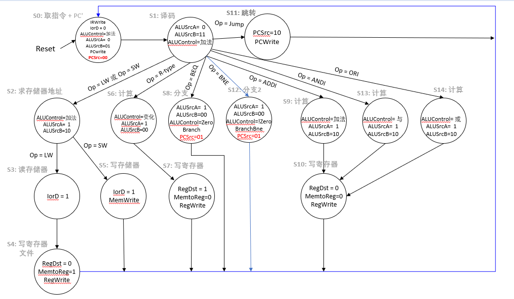

## 实验3:多周期MIPS处理器

## 设计思路
多周期处理器与单周期处理器的不同之处主要子啊与，多周期CPU将每条指令的执行过程拆分成多个阶段，每个阶段用一个时钟周期完成。每种指令执行所需的阶段数不同，所用的时钟周期便不同。
因此，多周期处理器可以用一个有限状态机实现，如下图所示：

在该图基础上还扩展了bne和slti两个指令，因此需要额外增加四个状态：
1. bneex: ALUSrcA=1,ALUSrcB=00,branchbne=1,PCSrc=01,下一状态为fetch
2. slti:ALUSrcA=1，ALUSrcB=10，ALUControl=slt，下一状态为addiwb
据此修改主译码器(ppt中已给出)。

多周期CPU的结构可以参考下图：


相较于单周期CPU，多周期CPU的结构主要有以下变化：
1. 将imem和dmem合并为mem，用iord信号控制是读写存储器还是读取指令
在实现时为了尽可能多地复用单周期CPU中已有的模块，在top文件中使用一个2：1多路选择器。
```systemverilog
mux2#(32) muxreaddata(readdata1,readdata2,iord,readdata);
```
2. 使用多个寄存器暂存上个状态得到的数据
据此修改数据通路：
```systemverilog
module datapath(
            input logic clk,reset,
            input logic memtoreg,
            input logic [1:0]pcsrc,
            input logic alusrca,
            input logic [1:0]alusrcb,
            input logic regdst,regwrite,
            input logic [2:0]alucontrol,
            output logic zero,
            output logic [31:0] pc,
            input logic [31:0]instr,
            output logic [31:0]adr,writedata,
            input logic [31:0]readdata,
            input logic pcen,immext
        );
logic [4:0]writereg;
logic [31:0]pcnext,pcjump;
logic [31:0]signimm,signimmsh,zeroimm,imm;
logic [31:0]rd1,rd2,a,srca,srcb,aluresult,aluout,data,wd3;
assign adr=aluout;
flopenr #(32) pcreg(clk,reset,pcen,pcnext,pc);
sl2 immsh(signimm,signimmsh);
regfile rf(clk,regwrite,instr[25:21],instr[20:16],writereg,wd3,rd1,rd2);
flopr2 #(32) f1(clk,reset,rd1,rd2,a,writedata);
mux2 #(5) wrmux(instr[20:16],instr[15:11],regdst,writereg);
signext se(instr[15:0],signimm);
zeroext ze(instr[15:0],zeroimm);
mux2#(32) extmux(signimm,zeroimm,immext,imm);
alu alu(srca,srcb,alucontrol,aluresult,zero);
flopr #(32) f2(clk,aluresult,aluout);
flopr #(32) f3(clk,readdata,data);
mux2 #(32) datamux(aluout,data,memtoreg,wd3);
mux2 #(32) srcamux(pc,a,alusrca,srca);
mux4 #(32) srcbmux(writedata,4,imm,signimmsh,alusrcb,srcb);
assign pcjump={pc[31:28],instr[25:0],2'b00};
mux4#(32) pcmux(aluresult,aluout,pcjump,0,pcsrc,pcnext);
endmodule
```

## 实验效果
1. 仿真测试：和单周期CPU相同，使用memfile.dat测试了基本指令，使用memfileext.dat测试了拓展指令
测试效果分别如下图：


2. 上板测试：结果如下图,正确完成了加法功能


### 实验总结
1. 本次实验基本上是在单周期CPU的基础上进行修改完成，在这个过程中深入理解了单周期与多周期的不同之处。同时对多周期处理器中，不同使能信号起到什么作用、每个指令应该被拆分成什么样的阶段有了更深刻的理解。
2. 相较于单周期CPU，多周期CPU在指令拓展上的难度显然更低（只需要加入相应的状态）；且所需的不同模块数也减少了。
