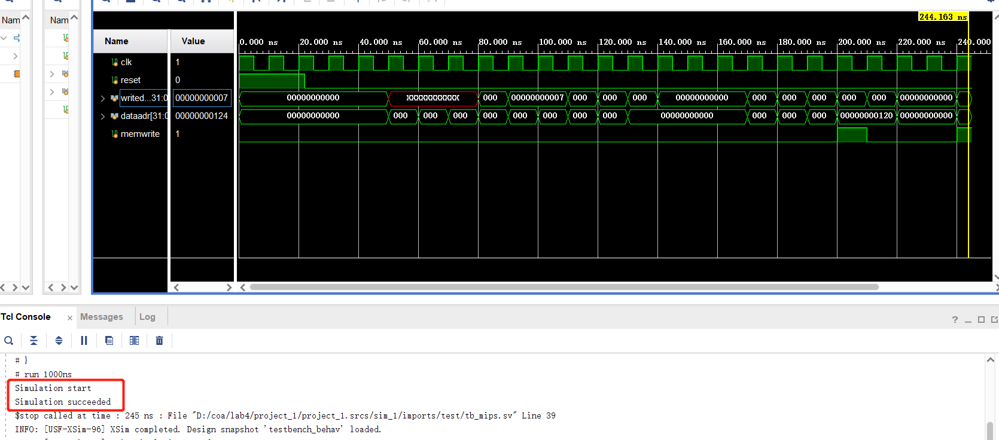
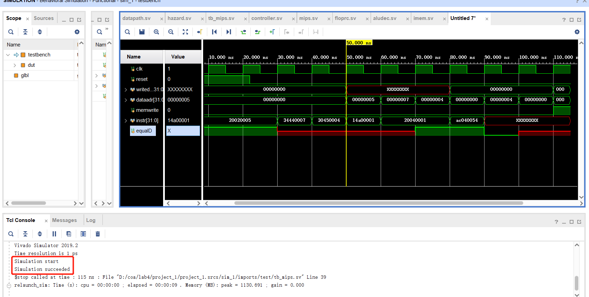
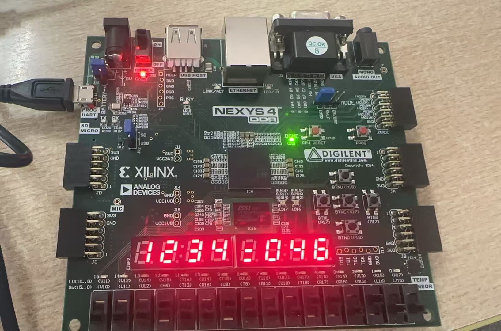

# 实验4：流水线MIPS处理器
## 设计思路
相较于单周期/多周期MIPS处理器，流水线处理器主要需要解决的是冒险问题。解决方法如下：
1. 结构冒险问题：寄存器文件访存冲突
    解决：将寄存器文件读口和写口分离，在下降沿（时钟的前半个周期）写入，上升沿（时钟的后半个周期）读取。实现如下：
```systemverilog
logic [31:0] rf[31:0];
always_ff @(negedge clk) //在下降沿写入数据
    if(we3) rf[A3]<=WD3;
assign RD1=(A1!=0)? rf[A1]:0;
assign RD2=(A2!=0)? rf[A2]:0;
```
2. 数据冒险问题：
    1. 写后读（RAW）：采用转发技术解决，将数据通路中生成的中间数据转发到ALU的输入端。
    2. load-use数据冒险：阻塞流水线
3. 控制冒险问题：在ID阶段完成beq指令的比较和地址计算    
    
使用`hazard`模块检测数据冒险和控制冒险的存在，实现如下：
```systemverilog
//forward to D
//分支指令需要在ID阶段比较寄存器值，检测是否需要将Mem阶段的寄存器值转发到ID阶段
assign forwardaD=(rsD!=0&rsD==writeregM & regwriteM);
assign forwardbD=(rtD!=0 & rtD ==writeregM & regwriteM);

//forward to E
//Ex阶段需要从寄存器中读取操作数，检测是否需要将Mem阶段或WB阶段的寄存器值转发到Ex
always_comb begin
    forwardaE=2'b00;
    forwardbE=2'b00;
    if (rsE!=0)
        if (rsE ==writeregM & regwriteM) forwardaE=2'b10;
    else
        if (rsE==writeregW & regwriteW) forwardaE=2'b01;
    if (rtE!=0)
        if(rtE==writeregM & regwriteM) forwardbE=2'b10;
    else
        if (rtE==writeregW & regwriteW) forwardbE=2'b01;
end

//stalls
//若存在load-use冒险，需要阻塞流水线
assign lwstallD=memtoregE & (rtE==rsD | rtE==rtD);
//若分支的条件数据没有准备好，则阻塞流水线
assign branchstallD=(branchD | branchbneD)& 
                (regwriteE & (writeregE==rsD | writeregE ==rtD)|
                memtoregM & (writeregM ==rsD | writeregM ==rtD));
assign stallD=lwstallD | branchstallD;
assign stallF=stallD; //暂停取指和译码，防止无效指令前进
assign flushE=stallD; //清空Ex阶段的指令
```

相应的，数据通路中需要加入多路复用器用于选择转发数据和原始数据，以及带使能和清空的触发寄存器用于阻塞流水线。增加的模块如下：
```systemverilog
//fetch stage
//stallF为1时，不更新pc地址
flopenr #(32) pcreg(clk,reset,~stallF,pcnextFD,pcF);

//decode
//stallD为1时，不更新指令
flopenr #(32) r1D(clk,reset,~stallD,pcplus4F,pcplus4D);
//分支预测失败时，清空无效指令
flopenrc #(32) r2D(clk,reset,~stallD,flushD,instrF,instrD);
//分支指令的比较
eqcmp comp(srca2D,srcb2D,branchbneD,equalD);

//对于j指令，需要清空后续无效指令
assign flushD=pcsrcD | jumpD;

//execute stage
//flushE为1，清空寄存器
floprc #(32) r1E(clk,reset,flushE,srcaD,srcaE);
floprc #(32) r2E(clk,reset,flushE,srcbD,srcbE);
floprc #(32) r3E(clk,reset,flushE,immD,immE);
floprc #(5) r4E(clk,reset,flushE,rsD,rsE);
floprc #(5) r5E(clk,reset,flushE,rtD,rtE);
floprc #(5) r6E(clk,reset,flushE,rdD,rdE);
//选择转发数据或原数据
mux3 #(32) forwardaemux(srcaE,resultW,aluoutM,forwardaE,srca2E);
mux3 #(32) forwardbemux(srcbE,resultW,aluoutM,forwardbE,srcb2E);
mux2 #(32) srcbmux(srcb2E,immE,alusrcE,srcb3E);
```

对于扩展指令，主要是bne指令的实现需要对原处理器进行改动。因为bne是分支指令，所以需要对其进行分支预测。将eqcmp模块修改为如下，使bne指令的预测结果和beq相反
```systemverilog
module eqcmp(input logic [31:0] a,
             input logic [31:0] b,
             input logic c,
             output logic eq);
assign eq=(a==b)^c;
endmodule
```
此时pcsrcD的取值写为：
```systemverilog
assign pcsrcD=(branchD & equalD)|(branchbneD & equalD);
```
## 实验效果
仿真测试：
对基础指令的测试结果如下图所示：


对扩展指令的测试结果如下图所示：


可见能将正确数值写入正确地址，仿真正确。
上板测试：
在板上测试加法指令的结果如下图所示：


发现能正确执行加法，上板成功。

## 实验总结
通过进行流水线的设计更深入理解了流水线处理器处理冒险问题的方法。原本觉得书上以及ppt上描述的数据转发和阻塞流水线特别抽象，在verilog中变成了一个个控制信号后就更能理解流水线是如何进行冒险检测并进行解决的。
这三次设计cpu的实验不仅让我对每种cpu的架构更加熟悉，也让我更深刻地体会到他们之间的差异。除此之外，也让我更熟悉硬件的架构流程及实现细节，比如应该如何拆解能够得到可以被反复使用的基础模块，如何将基础模块相连以实现总体功能。
